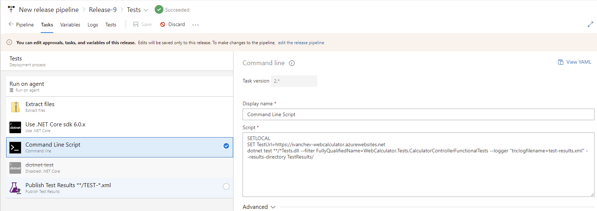

Для начала создадим minimal api (калькулятор) на .net 6 фраемворке. Также создадим юнит и функциональные тесты для тестирования апи.


Все тесты пройдены успешно. Апишка работает корректно.

Такой конфиг будет использоваться при создании Пайплайнов

```yaml
trigger: # в данном блоке определяется, при каком событии запускать пайплайн
- master # запускаем, как только пришел новый коммит в ветку master

pool: # здесь определяем образ докера, в котором запускается приложение и версию интерпритатора
  vmImage: ubuntu-latest # выбираем ubuntu

variables:
  buildConfiguration: 'Release'

steps:
- task: UseDotNet@2
  displayName: 'Install .NET Core SDK'
  inputs:
    version: 6.0.x
    performMultiLevelLookup: true
    includePreviewVersions: true # Required for preview versions

- task: DotNetCoreCLI@2
  inputs:
    command: 'build'
    arguments: '--configuration $(buildConfiguration)'
    projects: '**/*.csproj'
  displayName: 'dotnet build $(buildConfiguration)'

- task: DotNetCoreCLI@2
  displayName: 'dotnet publish'
  inputs:
    command: 'publish'
    publishWebProjects: false
    projects: '**/*.csproj'
    arguments: '--configuration $(BuildConfiguration) --output $(Build.ArtifactStagingDirectory)'
    zipAfterPublish: True


# this code takes all the files in $(Build.ArtifactStagingDirectory) and uploads them as an artifact of your build.
- task: PublishPipelineArtifact@1
  inputs:
    targetPath: '$(Build.ArtifactStagingDirectory)' 
    artifactName: 'myWebsiteName'


# ...
# do this after other tasks such as building
- task: DotNetCoreCLI@2
  inputs:
    command: test
    projects: '**/*Tests/*.csproj'
    arguments: '--configuration $(buildConfiguration) --filter FullyQualifiedName!=WebCalculator.Tests.CalculatorControllerFunctionalTests'
```
На портале *Azure DevOps* выполним подключение гитхаб-репозитория

Создадим пайплайн на основе конфига


Пайплайн запустился корректно, все юнит тесты прошли успешно

В *artifacts* находятся ресурсы проекта и тестов, которые мы запаблишили


Создадим группы ресурсов в Azure Portal


Теперь релизнем созданный пайплайн.

Вот что получилось для работы апишки и функциональных тестов к ней.


Настроим deploy для работы сайта


Перейдём на запущенный сайт ```https://ivanchev-webcalculator.azurewebsites.net/calculator/add/1&2``` и наблюдаем, что всё работает


Создадим ещё один *Stage* для тестирования и произведём её настройку

Для начала разархивируем файлы из артифакта.


Далее установим шестой дотнет, так как он не предустановлен.


Далее исполним следующие команды для работы тестов.

```shell
SETLOCAL
SET TestUrl=https://ivanchev-webcalculator.azurewebsites.net
dotnet test **/*Tests.dll --filter FullyQualifiedName=WebCalculator.Tests.CalculatorControllerFunctionalTests --logger "trx;logfilename=test-results.xml" --results-directory TestResults/
```



Далее запаблишем тесты из полученного файла с логами пройденных тестов.


Теперь производим запуск нового релиза.

Видим что все ступени для тестов были пройдены.


И что тесты пройдены успешно


По итогу работы с пайплайнами появляется возможность добавить в свой проект данный status badge, позволяющий увидеть состояние пайплайна

[](https://dev.azure.com/alekseevap0275/ivanchev/_build/latest?definitionId=4&branchName=master)

